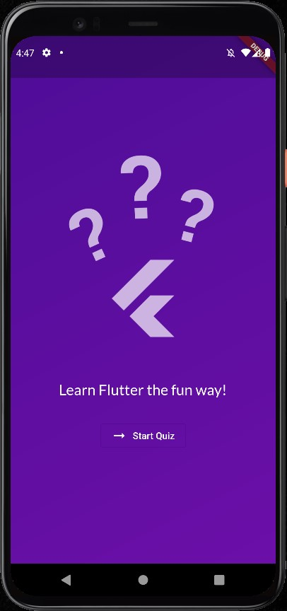
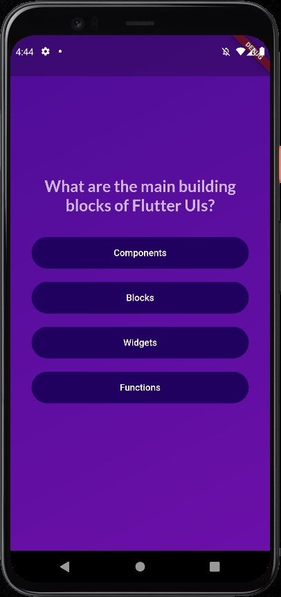
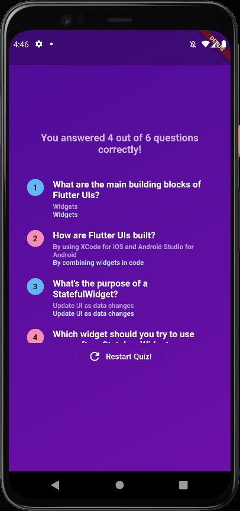

# Quiz App

## Tabela de conteúdos

- [Sobre o projeto](#sobre-o-projeto)
- [Screen Shots](#screen-shots)
- [Como executar o projeto](#como-executar-o-projeto)
  - [Pré-requisitos](#pré-requisitos)
  - [Como rodar o projeto](#como-rodar-o-projeto)
- [Tecnologias](#tecnologias)
- [Autor](#autor)

## Sobre o projeto

Um APP de quiz para testar seus conhecimentos em Flutter. Foi o segundo APP desenvolvido no curso de [Flutter](https://www.udemy.com/course/learn-flutter-dart-to-build-ios-android-apps/) adquirido na Udemy.

## Screen Shots

<p>
  
  
  
  
</p>

## Como executar o projeto

### Pré-requisitos

Para rodar o projeto, você precisa ter em sua máquina a seguinte ferramenta: [Flutter](https://docs.flutter.dev/get-started/install).

### Como rodar o projeto

- Baixe o projeto para sua máquina com as seguintes instruções:

```bash
# Clone este repositório
$ git clone https://github.com/angelo-filho/Roll-Dice.git

# Acesse a pasta do projeto
$ cd Roll-Dice
```

- Instale as dependências e então inicialize o projeto

```bash
# Instale as dependências
$ flutter pub get

# Execute a aplicação em modo de desenvolvimento
$ flutter run
```

### Tecnologias

As seguintes ferramentas foram usadas na construção do projeto:

- [Flutter](https://flutter.dev/)
- [Google Fonts](https://pub.dev/packages/google_fonts)

### Autor

<a href="https://github.com/angelo-filho">
  
  <br />
  <sub><b>Angelo Filho</b></sub>
</a>

[](https://www.linkedin.com/in/angelo-filho-4a44a8190/)
[](mailto:angelo.filho06@gmail.com)

Feito com ❤️ por Angelo Filho. Entre em contato!
